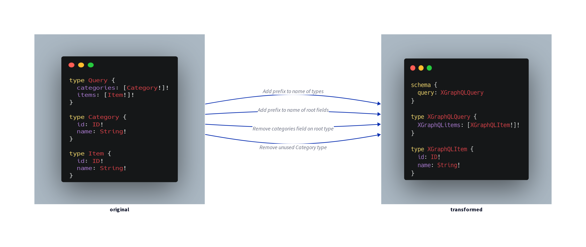

Schema Transformer
==================


[](https://codecov.io/gh/x-graphql/schema-transformer)

Transform SDL and enhance execution query of [GraphQL schema](https://webonyx.github.io/graphql-php/schema-definition/)




Getting Started
---------------

Install this package via [Composer](https://getcomposer.org)

```shell
composer require x-graphql/schema-transformer
```

Usages
------

```php
use GraphQL\GraphQL;
use XGraphQL\HttpSchema\HttpExecutionDelegator;
use XGraphQL\HttpSchema\SchemaFactory;
use XGraphQL\SchemaTransformer\AST\PrefixRootFieldsNameTransformer;
use XGraphQL\SchemaTransformer\SchemaTransformer;

$delegator = new HttpExecutionDelegator('POST', 'https://countries.trevorblades.com/');
$factory = new SchemaFactory($delegator);
$transformer = new SchemaTransformer(
  $factory->fromIntrospectionQuery(),
  [
     new PrefixRootFieldsNameTransformer('XGraphQL_')
  ],
);
$schema = $transformer->transform();

$query = <<<'GQL'
query getCountries {
  XGraphQL_countries {
    name
  }
}
GQL;

$result = GraphQL::executeQuery($schema, $query);

var_dump($result->data);
```


Credits
-------

Created by [Minh Vuong](https://github.com/vuongxuongminh)
